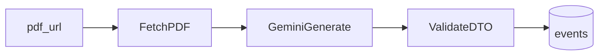

# Phase 2 — PR breakdown

> **Retroactive note (pivot to risk-analysis workspace):** Phase 2 was originally
> the only LLM surface in Verdict. Under the pivot (see `SPEC.md` and
> [docs/plans/phase-3.md](phase-3.md)), Phase 2's Gemini pipeline stays as the
> **briefing-metadata ingestion path** — it produces clean `events` rows from
> FDA briefing PDFs and nothing more. The **LLM analyst memo** (efficacy,
> safety, regulatory precedent, AdCom posture, key risks, probability range +
> point estimate) is a different artifact and is introduced in Phase 3 PR C as
> a separate service writing to a new `llm_analyst_memo` table plus a paired
> `llm_forecast` row for calibration. Phase 2's PDF fetch, SSRF guards, and
> validator/retry plumbing are reusable; its DTO and prompt are not, because the
> Phase 3 memo is a structured analysis, not a metadata extraction. No work in
> Phase 2 needs to be undone.

Phase 2 adds LLM-assisted ingestion of FDA briefing PDFs: fetch by URL, call **Google Gemini**, validate structured output, and persist a clean `events` row (see `SPEC.md`). This document splits work into small mergeable PRs (target roughly 100–300 LOC each).

These PRs are **implementation sketches and sequencing notes**—not binding line counts. Phase 2 completion is **local-first**: success does **not** depend on Fly.io or Vercel; verify against Docker Postgres + documented manual checks on real FDA.gov PDFs.

**Vertical slice:** Ship **URL-based ingest first** (`pdf_url` → fetch → Gemini → validate → insert). **Multipart PDF upload** is an optional late slice (PR 8) if you want parity with SPEC’s “URL or upload” without blocking the core pipeline.

---

## PR 1 — Event schema + API parity for PDUFA metadata

**Goal:** Make the database and JSON shapes capable of holding everything Phase 2 extracts from briefings.

**Backend changes:**
- SQLx migration on `events`: add nullable columns aligned with `SPEC.md` and Phase 2 bullets—for example `advisory_committee_date` (DATE), `primary_endpoint` (TEXT), and a nullable field for **advisory committee vote** when held (prefer plain `TEXT` plus validation at write time over brittle free-form JSON).
- CHECK constraints only where they reduce garbage without blocking legitimate FDA phrasing; otherwise validate in Rust.
- Update `POST /events`, `GET /events`, and `EventResponse` (and related `query!` / `query_as!` macros) so list/create paths expose new fields consistently.
- Refresh committed `apps/api/.sqlx/` offline query metadata.

**Frontend changes:** None, unless TypeScript event types must extend for strict parsing.

**Success criterion:** Migrations apply on a fresh DB; existing Phase 1 flows behave as before; `cargo check`, `cargo clippy -- -D warnings`, and `cargo test` pass.

**Rough LOC estimate:** ~180–280 lines.

---

## PR 2 — Config + outbound HTTP plumbing (`reqwest`) + LLM API settings

**Goal:** Introduce secrets and a shared HTTP client without coupling to PDF ingestion yet.

**Backend changes:**
- Add `reqwest` to `apps/api/Cargo.toml` workspace dependencies; depend from `crates/api`.
- Extend `AppState` (or a small nested config struct held by `AppState`) with a configured `reqwest::Client` (timeouts, HTTPS).
- Load **`GEMINI_API_KEY`** from the environment; optional **`GEMINI_MODEL`** defaulting to the project standard in `CLAUDE.md` (currently `gemini-2.5-flash-lite`; pin a different id in env when you need reproducibility).
- Document vars in `apps/api/.env.example`.
- No `unwrap()` / `expect()` on production paths; use `thiserror` and propagate.

**Note:** An earlier slice may have used Anthropic env names; the stack is **Gemini** from PR 3 onward.

**Frontend changes:** None.

**Success criterion:** Workspace builds and tests pass; misconfiguration surfaces as a clear startup or handler error (recommended: **fail fast at startup** for API processes that include ingestion routes, so missing keys are obvious in dev).

**Rough LOC estimate:** ~140–240 lines.

---

## PR 3 — PDF acquisition + SSRF-safe URL ingest (Gemini-oriented stack)

**Goal:** Given an HTTPS URL to an FDA briefing PDF, fetch bytes safely for downstream **Gemini** calls. Fold in the **LLM provider switch** (Anthropic → Google Gemini): shared HTTP client + secrets use **`GEMINI_API_KEY`** / **`GEMINI_MODEL`**; deployment remains out of scope (local-first).

**Backend changes:**
- New module `ingest::pdf_fetch` using a **dedicated** `reqwest::Client` with **redirect validation** (each redirect target must pass the same host/https rules).
- Enforce **maximum download size** (`FDA_PDF_MAX_BYTES`, default 25MiB), **`%PDF` magic-byte** checks, and **`Content-Type` heuristics** (e.g. reject obvious `text/html`).
- **Host allowlisting** via `FDA_PDF_ALLOWED_HOST_SUFFIXES` (comma-separated; default `fda.gov`). Optional **`FDA_PDF_ALLOW_INSECURE_LOCALHOST`** for loopback **HTTP** stub servers in dev/tests only—leave `false` in real environments.
- Mitigate **SSRF:** HTTPS-only for non-loopback URLs, no credentials in the URL, no raw non-loopback IP hosts, non-default HTTPS ports rejected.
- Map failures to existing `AppError` variants (`BadRequest`, etc.) with stable messages for API consumers.
- **`reqwest` feature `stream`** enabled so the body can be capped without loading unbounded bytes into memory.
- Update **`CLAUDE.md`**, **`SPEC.md`** Phase 2, **`.cursor/rules/verdict.mdc`**, and this plan so the documented LLM is **Gemini**, not Anthropic.

**Frontend changes:** None.

**Success criterion:** Automated tests cover fetch limits and rejection paths using a **local stub TCP server**—do not depend on live FDA.gov in CI. `apps/api/README.md` (or this doc) notes how to try a real FDA URL locally.

**Rough LOC estimate:** ~220–360 lines.

---

## PR 4 — LLM extraction contract + validation + retry policy

**Goal:** Define the Rust DTO for **Gemini** JSON output, validate with `validator`, and retry bounded times when decoding or validation fails.

**Backend changes:**
- Typed extraction struct(s) matching Phase 2 fields: drug, sponsor, indication, advisory committee date, PDUFA / decision date, primary endpoint, advisory vote when present (exact shape follows PR 1 columns).
- Parse model output as JSON; reject invalid shapes **before** DB insert.
- **Bounded retries** on schema failure (e.g. repair prompt or regeneration); log retry counts with `tracing`.
- Call **Google Gemini** generate API with PDF input using the bytes from PR 3. Prefer **`reqwest` + `serde`** for HTTP to stay aligned with `CLAUDE.md`; if a separate Google SDK is introduced, add a one-line justification in the PR (stack rule).
- Centralize prompt and model identifier constants for tuning later.

**Frontend changes:** None.

**Success criterion:** Unit tests with **golden malformed outputs** fail closed; **valid fixture JSON** maps into DTOs and passes validation; retry behavior is observable in logs.

**Rough LOC estimate:** ~260–380 lines (prompt + tests).

---

## PR 5 — Persist: ingest endpoint creates `events` row

**Goal:** Close the Phase 2 loop: **URL → fetch PDF → Gemini → validate → insert**.

**Backend changes:**
- New route (example name: `POST /events/from-fda-briefing`) with JSON body `{ "pdf_url": "..." }` (final path chosen to nest cleanly under `apps/api/crates/api/src/app.rs`).
- Orchestrate PR 3 + PR 4; single SQLx `INSERT` into `events` with `kind = 'fda_pdufa'`, `status = 'upcoming'`, `source_url` set to the provided URL, and extracted columns populated.
- Deterministic **`title` derivation rule** (e.g. drug + decision date)—document in module/handler comment so UI lists stay stable.
- Return `201 Created` with `EventResponse` (extended in PR 1).
- `#[sqlx::test]` proves insert behavior with **mocked or stubbed Gemini** (introduce a trait/object seam in PR 4/5 so tests do not call the real API).

**Frontend changes:** None.

**Success criterion:** Local stack with a valid API key can ingest a real briefing URL and produce a row queryable via existing list endpoints; automated tests cover DB path without live Gemini.

**Rough LOC estimate:** ~200–300 lines.

---

## PR 6 — Frontend: briefing ingest UI + client wiring

**Goal:** Provide an operator-friendly browser path for demos (paste URL → created event).

**Frontend changes:**
- Form on a new route or the home page: PDF URL input, submit, success state (show created event summary), structured error display for fetch/LLM/validation failures.
- Extend `apps/web/lib/api/client.ts` and Zod validators to match the ingest response and errors.
- Dev ergonomics: align with `NEXT_PUBLIC_API_BASE_URL` from `.env.example`.

**Backend changes:** Only if needed for browser dev (e.g. CORS allowlist for local Next origin—mirror Phase 1 patterns).

**Success criterion:** `pnpm typecheck`, `pnpm lint`, and `pnpm test` pass; manual click-through against local API succeeds.

**Rough LOC estimate:** ~240–340 lines.

---

## PR 7 — Real-document verification + developer playbook

**Goal:** Satisfy SPEC: verified working on **at least three real FDA.gov briefing PDFs**.

**Deliverables:**
- Add a concise playbook (prefer extending `apps/api/README.md` **or** a single `docs/` page—avoid duplicating the same instructions twice): list three URLs, date verified, expected extracted fields, and known caveats (ocr-heavy scans, multi-drug PDFs, etc.).
- Optional: commit **redacted JSON fixtures** for regression testing of validation only (no secrets; no network in CI).

**Backend / frontend changes:** Minimal—documentation and tiny fixtures only unless a gap appears during verification.

**Success criterion:** Another developer can reproduce all three successes using local Postgres, migrations, and env vars—**no paid hosting required**.

**Rough LOC estimate:** ~120–220 lines.

---

## PR 8 (optional) — Multipart PDF upload

**Goal:** Support SPEC’s “URL **or** upload” without duplicating extraction logic.

**Backend changes:**
- `multipart/form-data` endpoint streaming PDF bytes into the **same** validation + Gemini path as URL fetch (reuse size caps and PDF checks).
- Document trust boundary: virus scanning and enterprise policy are **out of scope**; uploads are treated as user-supplied binary input within size limits.

**Frontend changes:** File input + upload to new endpoint; reuse success/error UX from PR 6.

**Success criterion:** Same extraction quality as URL path on equivalent PDF bytes; automated tests cover multipart parsing limits.

**Rough LOC estimate:** ~200–280 lines.

---

## Cross-cutting concerns

- **Auth:** Events remain global in v1 (`SPEC.md`); ingestion does not require attaching a `user_id` to `events` unless the data model changes—keep consistency with the Phase 1 stub user story for forecasts only.
- **Cost control:** Log approximate payload sizes; enforce strict PDF byte limits; avoid background polling (Phase 3 owns Apalis + Redis).
- **Validation boundaries:** Never insert LLM output without passing Rust validation; retries are for **machine-readable repair**, not silent coercion.
- **Scope:** No Polymarket/Kalshi, no market time-series, no WebSockets—those are Phase 3 per `SPEC.md`.
