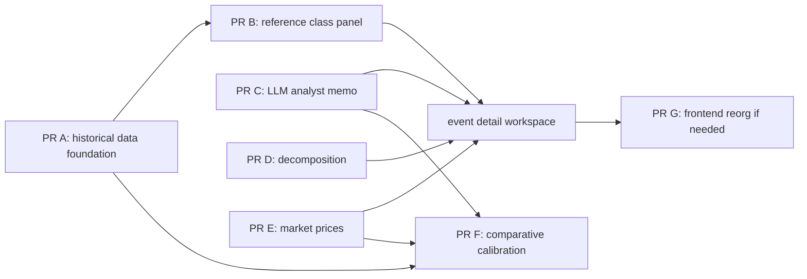

# Phase 3 — PR breakdown

Phase 3 is the pivot from forecasting journal to forecasting-and-risk-analysis
workspace (see `SPEC.md`). It introduces historical reference data, a
reference-class matching service, an LLM analyst memo service, an optional
decomposition tool, market-price ingestion, and a comparative calibration
dashboard.

These PRs are **implementation sketches and sequencing notes** — not binding
line counts. Each PR must be independently mergeable, must compile, and must
keep `cargo check`, `cargo clippy -- -D warnings`, `cargo test`, and
`cargo fmt` clean (plus frontend gates for frontend PRs).



---

## PR A — Historical event data foundation via openFDA

**Goal:** Build a structured dataset of historical FDA drug approval
decisions by ingesting openFDA's `drug/drugsfda` endpoint, narrowed to
**original approved submissions** (NDA/BLA) from 2010 onward, and enriching
a meaningful subset with additional features for reference-class matching.

This is the largest PR in the project so far. Realistically 500–700 LOC
across the migration, two binaries, the openFDA client, validation, and
tests. Do not split unless absolutely necessary — the pieces are
interdependent.

**Backend changes, in order:**

1. **Migration: `historical_event` table** with columns:
   - `id uuid primary key default gen_random_uuid()`
   - `application_number text not null unique` (e.g. `"NDA022264"`)
   - `drug_name text not null`
   - `sponsor_name text not null`
   - `application_type text not null check (application_type in ('NDA','BLA','ANDA','other'))`
   - `approval_date date not null` (from the **original approved submission**, see #2)
   - `review_priority text` (`'priority' | 'standard'`, nullable)
   - `indication_area text` (controlled vocabulary, nullable until enriched):
     `oncology | metabolic | neurological | cardiovascular | infectious_disease |
     immunology | rare_disease | other`
   - `primary_endpoint_type text` (controlled vocabulary, nullable)
   - `advisory_committee_held boolean` (nullable)
   - `advisory_committee_vote text` (`'favorable' | 'mixed' | 'unfavorable'`, nullable)
   - `decision_outcome text not null check (decision_outcome in ('approved','approved_with_rems','crl'))`
     — openFDA rows are always `'approved'`; `'crl'` is reachable only via
     the manual override path.
   - `enrichment_status text not null check (enrichment_status in ('structured_only','llm_enriched','manually_reviewed'))`
   - `source text not null` (`'openfda' | 'manual'`)
   - `raw_openfda_data jsonb` (nullable; preserve the original API response)
   - `notes text` (nullable)
   - `created_at`, `updated_at` timestamps
   - Indexes: `(application_number)`, `(indication_area)`, `(enrichment_status)`,
     `(approval_date)`.

2. **openFDA client at `apps/api/crates/api/src/services/openfda.rs`:**
   - Query `https://api.fda.gov/drug/drugsfda.json` with pagination via the
     `skip` + `limit` parameters (max `limit=1000`, max `skip + limit = 26000`
     per the openFDA contract — pin both as module constants).
   - **Authenticate every request** with `OPENFDA_API_KEY` as the `api_key`
     query parameter. Without a key the daily limit is 1,000 requests per
     IP, which cannot complete a meaningful run; the binary should refuse to
     start without `OPENFDA_API_KEY` and print the signup URL.
   - With a key the limits are 240 req/min and 120,000 req/day per key.
     The client sleeps between pages to stay under the per-minute limit
     (configurable, default ~250ms between pages).
   - The query narrows the dataset server-side but **does not** rely on
     nested-field correlation. openFDA's search syntax does **not**
     correlate two predicates within the same array element, so a query
     like `submissions.submission_type:ORIG AND
     submissions.submission_status:AP AND submissions.submission_status_date:[20100101 TO 20261231]`
     can return a record whose ORIG was old but whose recent SUPPL matched
     the date. The client uses a coarse server-side filter
     (`application_number:NDA* OR application_number:BLA*` plus a date
     window for cheap rejection) and **does the precise selection in Rust**
     (see #3).
   - Returns raw response records preserving the full structure.

3. **Original-submission selection (critical):**
   The mapper that converts an openFDA record into a `historical_event` row
   must:
   - Locate the submission inside `submissions` whose
     `submission_type` is `"ORIG"` **and** `submission_status` is `"AP"`.
     If multiple ORIGs exist (rare; e.g., a re-approved application), pick
     the earliest `submission_status_date`.
   - Use that submission's `submission_status_date` (format `YYYYMMDD`) as
     `approval_date`. If the parsed date is not in the configured window
     (default 2010-01-01 through today), the record is skipped.
   - Read `review_priority` from the same ORIG submission, lowercased
     (`"PRIORITY"` → `"priority"`, `"STANDARD"` → `"standard"`,
     `"UNKNOWN"` / missing → `null`).
   - Derive `application_type` from the `application_number` prefix:
     `NDA*` → `'NDA'`, `BLA*` → `'BLA'`, `ANDA*` → `'ANDA'`, else `'other'`.
     The ingestion binary should filter out `'ANDA'` and `'other'` before
     insert.
   - Read `drug_name` from `openfda.brand_name[0]` if present, else
     `products[0].brand_name`, else skip the record with a warning.
   - Read `sponsor_name` from the top-level `sponsor_name` field.
   - Persist the entire openFDA record as `raw_openfda_data` for future
     re-processing.

4. **Ingestion binary at `apps/api/crates/api/src/bin/ingest_historical.rs`:**
   - Pulls openFDA records via the client, paginating through the result set.
   - For each record: run the mapper from #3; if all required fields are
     present and `application_type` is NDA or BLA, upsert by
     `application_number` (`ON CONFLICT (application_number) DO UPDATE`)
     so re-runs are idempotent. CMC / labeling supplements never land here
     because the mapper rejects them.
   - Sets `indication_area`, `primary_endpoint_type`,
     `advisory_committee_*` to null and `enrichment_status` to
     `'structured_only'` on first insert. On re-ingest, do **not** clobber
     enriched fields — only refresh structured fields and
     `raw_openfda_data`.
   - Logs progress (records seen, inserted, updated, skipped with reason
     counters).
   - Accepts `--from-date` / `--to-date` flags; defaults to 2010-01-01
     through today.

5. **Enrichment binary at `apps/api/crates/api/src/bin/enrich_historical.rs`:**
   - Selects records currently at `enrichment_status = 'structured_only'`,
     optionally filtered by `--from-year`, `--sponsor`, or `--batch-size`.
   - For each record: query openFDA `drug/label.json` by
     `openfda.application_number` (preserved in `raw_openfda_data`), pull
     the most recent label, and send the prescribing-information text to
     Gemini with a prompt asking for:
     - `indication_area` (from the controlled vocabulary)
     - `primary_endpoint_type` (from the controlled vocabulary; may be
       `null` if the label does not state one — many do not)
     - `advisory_committee_held` and `advisory_committee_vote` if mentioned
       (rarely available in labels — expect mostly null)
     - `confidence` (0–1 per field)
   - Validates the LLM output: required fields present, controlled
     vocabulary values, each `confidence ≥ 0.7`. Fields failing
     confidence stay null; fields passing get written. A record with at
     least one field successfully enriched is flipped to
     `enrichment_status = 'llm_enriched'`. A record where everything failed
     stays `'structured_only'` so a later run can retry.
   - Idempotent and resumable. Logs per-field success counters.
   - **Coverage expectations** (calibrate against these during the first
     batch):
     - `indication_area`: high (labels almost always state an indication).
     - `primary_endpoint_type`: moderate (labels summarize endpoints but
       inconsistently).
     - `advisory_committee_*`: low (labels rarely mention AdCom outcomes).

6. **Manual review / override endpoint:**
   - `POST /admin/historical_events/{id}` accepts a JSON patch of any
     field (validated against the same constraints), sets
     `enrichment_status = 'manually_reviewed'`, and writes the override.
     Auth: same Clerk middleware path as the rest of the API (single user,
     so effectively gated on the logged-in user).
   - No frontend yet — direct API access via `curl`.
   - This is the **only path** by which `decision_outcome = 'crl'` enters
     the dataset, and therefore the only path by which a reference class
     gains the CRL coverage needed for base-rate computation in PR B.

7. **Documentation at `docs/historical_events_curation.md`:**
   - High-level pipeline architecture.
   - **API key is required**, with the signup link
     (<https://open.fda.gov/apis/authentication/>) prominent at the top
     and a note that the unauthenticated daily limit (1,000 requests/IP)
     cannot complete an ingestion run.
   - Commands:
     `cargo run --bin ingest_historical -- --from-date 2010-01-01`
     `cargo run --bin enrich_historical -- --batch-size 50`
   - openFDA approval-only bias, including the consequence for base rates
     in PR B and how to add CRL records via the manual override endpoint
     for high-importance applications (e.g., Aduhelm pre-approval CRL
     analogs, Relyvrio, etc.).

**Tests:**

- Unit test for the original-submission selector against a fixture record
  with **both** an ORIG (`AP`, e.g. 2012) and a recent SUPPL (`AP`, e.g.
  2025). The selector must pick the ORIG and surface 2012 as
  `approval_date`. The fixture should be a redacted real openFDA record
  (BLA761306 or similar) committed under `tests/fixtures/`.
- Unit test for application-type prefix derivation (`NDA*`, `BLA*`,
  `ANDA*`, anything else).
- Unit test for `drug_name` fallback chain.
- Integration test for ingestion idempotency: run the mapper-and-upsert
  path twice over the same fixture set; assert that row count is stable
  and that enriched fields on a pre-existing row are not clobbered on
  re-ingest.
- Unit tests for the enrichment validator: malformed JSON, missing field,
  out-of-vocabulary value, low-confidence field, all-fields-null result.

**Out of scope for this PR:** any UI, any reference-class matching, any
market integration, any LLM analyst memo on current events.

---

## PR B — Reference-class matching service and panel

**Goal:** Given a current `Event`, find the K most similar historical
events and surface them on the event detail page. Show base rates **only**
when the matched class has enough approvals and enough CRLs.

**Backend changes:**

- New module `apps/api/crates/api/src/services/reference_class.rs`. Function
  signature roughly:
  ```
  match_reference_class(event: &Event, k: usize) -> Vec<ReferenceClassHit>
  ```
  where `ReferenceClassHit` carries the `HistoricalEvent`, a normalized
  similarity score in `[0, 1]`, and a `match_reasons: Vec<MatchReason>`
  describing which features matched.
- Matching algorithm (weighted, partial-enrichment tolerant):
  - **Hard match — `indication_area` exact:** large weight when the
    historical row has an `indication_area`. If null (record never
    enriched, or enrichment failed for this field), the feature is
    skipped, not penalized.
  - **Soft match — `application_type` exact:** medium weight.
  - **Soft match — `primary_endpoint_type` exact:** medium weight when
    present on both sides; skipped when either side is null.
  - **Soft match — `advisory_committee_held` agreement:** small weight
    when present; skipped when null on either side.
  - **Recency boost:** smooth boost favoring more recent approvals (e.g.,
    linear from 1.0 at 0 years old to 0.5 at 15 years old).
  - **Confidence weighting:** the final score is normalized by how many
    features were available to match on, so a record matched on indication
    + endpoint scores higher than one matched only on indication, but a
    record with fewer comparable features is not given an artificially
    boosted score.
- Only match against records where `enrichment_status` is **not**
  `'structured_only'`. Records that have never been enriched do not have
  the fields the algorithm needs.
- **Top K (default 20)** returned plus aggregate stats:
  - `sample_size`
  - `approval_count` and `crl_count`
  - `base_rate`: present **only if** `approval_count >= 5` and
    `crl_count >= 5`. Otherwise `null` with a `base_rate_reason` of
    `"approval_only_bias"` or `"insufficient_sample"`.
  - `enrichment_coverage`: percentage of returned hits with
    `enrichment_status = 'llm_enriched'` or `'manually_reviewed'`.
- New endpoint: `GET /events/{id}/reference_class?k=20`.
- TODO comment in the module noting that embedding-based similarity
  (e.g., on indication text or mechanism) may be revisited in a future PR
  if weighted-feature matching produces poor results.

**Frontend changes:**

- New panel on the event detail page (introduce the page if not present):
  **"Reference class."** Renders:
  - The aggregate block first: sample size, approval count, CRL count.
    Either a base-rate badge (when both ≥ 5) or an explicit caveat:
    > Approval-only data — not a base rate. Add CRL records via manual
    > override to enable base-rate computation for this class.
  - An expandable list of the K hits with drug name, sponsor, indication,
    application type, approval date, outcome, and the matched feature
    chips ("matched: indication_area, endpoint_type").
- Empty state when matching returns fewer than 5 hits: render
  "Insufficient reference class for this event type" rather than
  half-empty data.

**Tests:**

- Unit tests for the similarity scoring with hand-computed expected
  values:
  - Two records identical on indication only → known score.
  - Two records identical on indication and endpoint → known higher score.
  - Records with null endpoint on one side → endpoint feature skipped, not
    penalized.
  - Recency boost monotonicity assertion (more recent ≥ older when other
    features equal).
- Unit test for the base-rate gating: 5/5 → present, 4/5 → null with
  `"approval_only_bias"` / `"insufficient_sample"`, 10/0 → null with
  `"approval_only_bias"`.

---

## PR C — LLM analyst service

**Goal:** Given an event's briefing document, produce a structured analyst
memo via Gemini and store it on the event. Do **not** attempt to certify
that the LLM is well-calibrated. Store the point estimate as an
`LlmForecast` and let PR F's comparative calibration measure quality over
resolved events.

**Backend changes:**

- Migration adding `llm_analyst_memo` per `SPEC.md` data model, including
  point estimate plus low/high range columns (`estimated_probability`,
  `estimated_probability_low`, `estimated_probability_high`,
  `numeric(5,4)`).
- Migration adding `llm_forecast` table mirroring `forecast` for
  calibration purposes (`event_id`, `memo_id`, `probability`, `source`,
  `created_at`). One row per memo.
- New module `apps/api/crates/api/src/services/llm_analyst.rs`:
  - Carefully-engineered prompt asking for structured JSON across
    efficacy, safety, regulatory precedent, advisory committee posture,
    key risks (array), reasoning, and a probability **range + point
    estimate**.
  - Prompt instructs the model to: be conservative, flag uncertainty
    rather than hide it, avoid overclaiming, return `null` when the
    document does not support a field. The reasoning must explicitly
    justify the range width.
  - `validator`-equivalent validation at the boundary: ranges must satisfy
    `0 <= low <= point <= high <= 1`; key_risks bounded length and item
    length; reasoning bounded length.
  - Retry once on malformed JSON. Log retry counts.
- New endpoints:
  - `POST /events/{id}/llm_analyst` — generate a memo (writes
    `llm_analyst_memo` and a paired `llm_forecast` row).
  - `GET /events/{id}/llm_analyst` — return the most recent memo.
- Track every memo's point estimate as an `LlmForecast`. On regeneration,
  insert a new row; the calibration query in PR F uses the most recent
  memo per event.

**Frontend changes:**

- New panel on event detail page: **"Analyst view."** Sections for
  efficacy, safety, regulatory precedent, AdCom posture, key risks,
  reasoning. **Generate analyst view** button when no memo exists;
  **Regenerate** otherwise. Loading state during generation (Gemini calls
  with a PDF can take several seconds).
- Point estimate displayed prominently next to its range
  ("LLM estimate: 0.62 (range 0.45–0.75)") with the explicit label
  *"LLM estimate — one input, not authoritative."*

**Tests:**

- Unit tests for the validator: malformed JSON, range inversion, out-of-
  range value, missing required field, empty key_risks, oversize text
  fields.
- Test that successful generation writes one `llm_analyst_memo` and one
  paired `llm_forecast` with matching `probability`.

---

## PR D — Decomposition tool

**Goal:** Optional structured decomposition of a forecast into conditional
probabilities. Simple "type a number and submit" remains the default.

**Backend changes:**

- Migration adding `forecast_decomposition` table per `SPEC.md` data
  model.
- Migration extending `forecast` with `gut_probability`,
  `decomposed_probability`, `discrepancy_flag`, and the four `reviewed_*`
  context-influence booleans.
- `POST /forecasts` (current path through nested router) accepts an
  optional `decomposition` array. When present:
  - Validate each step (question non-empty, conditional probability in
    `[0, 1]`).
  - Compute the product and store as `decomposed_probability`.
  - Set `discrepancy_flag = true` when
    `|gut_probability - decomposed_probability| > 0.10`.
  - Persist steps into `forecast_decomposition`.
- The user's submitted `probability` field is whichever number the user
  chose to commit to (gut, decomposed, or a third final number after
  reflecting on the discrepancy prompt).

**Frontend changes:**

- Forecast form: **Decompose this forecast** toggle. When enabled, add /
  remove conditional steps inline, each with a question and a probability
  input. Multiplied product computed live next to the gut number.
- On submit, if `|gut - product| > 0.10`, render a soft prompt: "These
  disagree by more than 10 points. Which do you trust?" and let the user
  pick or override.

**Tests:**

- Unit test for the product computation against hand-computed values.
- Unit test for the discrepancy threshold (exactly at 0.10 = no flag;
  0.1001 = flagged).
- Validator test rejecting any step with conditional probability outside
  `[0, 1]`.

---

## PR E — Market price integration

**Goal:** Pull Polymarket and Kalshi prices for tracked events, store a
time-series, display per-event panel.

**Backend changes:**

- Migration adding `market_price` table per `SPEC.md`.
- Migration adding `market_contract_overrides` nullable jsonb on `event`
  for manual contract IDs when automated matching fails (e.g.,
  `{"polymarket": "...", "kalshi": "..."}`).
- Matching service: for each upcoming `Event`, attempt to find
  corresponding contracts by drug name + decision date heuristics. If
  manual overrides exist, prefer those.
- Background polling every hour. **Use Apalis + Redis**, per the locked
  stack in `CLAUDE.md` (run as a separate worker binary in the same Cargo
  workspace). A pure `tokio_cron_scheduler` would be lighter, but
  consolidating on Apalis lets PR F and any future ingestion job reuse
  the same job runner; the trade-off (a Redis dependency and slightly
  more setup) is acceptable given the stack constraint.
- Endpoint `GET /events/{id}/market_prices?since=...` returning recent
  time-series rows.

**Frontend changes:**

- New panel on event detail page: **"Market view."** Current implied
  probability from each source as headline numbers, plus a 30-day chart
  of movement (Recharts line per source). User's most recent forecast
  rendered as a horizontal reference line when one exists.
- Empty state for events with no matched or overridden contracts:
  "No Polymarket or Kalshi contract is linked to this event. You can
  paste contract IDs from the event admin (TBD)."

**Tests:**

- Unit test for the contract matching heuristic with fixture event/
  contract pairs.
- Unit test for time-series query slicing.
- Integration test that polling is no-op for resolved events.

---

## PR F — Comparative calibration dashboard

**Goal:** Calibration metrics compare **user, LLM, and market** on the
same resolved events. Reliability diagrams overlaid; bootstrap confidence
intervals on Brier scores.

**Backend changes:**

- Update calibration computation to produce three series — user, llm,
  market — each with Brier contributions and reliability buckets. The
  pure scoring math (`brier_contribution`, `mean_brier`) in
  `apps/api/crates/api/src/scoring.rs` is source-agnostic and is reused
  per cohort; the hand-computed tests there stay locked per `CLAUDE.md`.
- Cohort source rules:
  - **User cohort:** `forecast` rows on resolved events.
  - **LLM cohort:** `llm_forecast` rows associated with the most recent
    `llm_analyst_memo` for each resolved event.
  - **Market cohort:** the `market_price` row closest to (but at or
    before) the event's `decision_date`, per source. If both Polymarket
    and Kalshi have a price, use Polymarket as the canonical market
    cohort; surface Kalshi alongside as informational.
- Bootstrap CIs on each cohort's mean Brier: 1000 resamples with
  replacement; report the 2.5th and 97.5th percentiles for a 95% CI.
  Use a fixed seed for testability. Tests pin one synthetic dataset and
  one expected CI window.
- Endpoint `GET /calibration` returns three series with reliability
  buckets, mean Brier, CI bounds, and sample size per cohort.
- Optional query filter `?indication_area=...` and `?since=...`.

**Frontend changes:**

- Calibration dashboard restructured. Reliability diagram with three
  overlaid lines plus a y = x reference. Brier scores rendered as
  `"User: 0.18 (95% CI 0.14–0.22) over 28 forecasts"` per cohort.
- Small-sample warning when any cohort `n < 10`.
- Per-indication-area breakdown filter.

**Tests:**

- Unit tests for the bootstrap CI against a synthetic dataset with a
  pinned RNG seed and pre-computed expected CI bounds.
- Test that the LLM cohort uses the most recent memo per event when
  multiple memos exist.
- Test that the market cohort prefers Polymarket when both sources have
  prices at the decision date.

---

## PR G — Frontend reorganization (conditional)

**Goal:** Consolidate the event detail workspace layout if incremental
panels become unmaintainable.

This PR is **conditional**, not guaranteed. Re-evaluate after PR D ships:
- If the event detail page is comfortable to navigate with the four
  panels (reference class, market, analyst, forecast/decomposition) plus
  the calibration link, defer this PR.
- If the page is crowded or the forecast form feels stuck inside an
  overflowing layout, do a focused frontend reorganization PR **before**
  PR E, not after PR G.

When this PR runs, scope is layout, tabbing, and panel collapsing only —
no behavioral changes to the underlying data flow.

---

## Cross-cutting constraints

- `CLAUDE.md` conventions apply: no `unwrap`/`expect` in production
  paths, `validator` at every boundary, SQLx macros for SQL,
  `rust_decimal::Decimal` for stored probabilities, no `Arc<Mutex<...>>`
  without an inline justification.
- Each PR is independently mergeable. Target 200–500 LOC per PR except
  PR A (500–700) and possibly PR F (may be larger due to bootstrap
  tests).
- Tests live adjacent to source. Hand-computed expected values for math:
  similarity scores, decomposition products, bootstrap CIs on fixed
  fixtures.
- Decomposition is optional throughout — the "type a number and submit"
  path stays the default.
- Probability estimates from any source (user, LLM, market, reference-
  class base rates) are presented as inputs, never as truth. Every UI
  surface labels its source and its uncertainty.
- openFDA's approvals-only coverage is honestly surfaced wherever the
  resulting data is used. The reference-class panel is **primarily
  qualitative**; base rates appear only when the matched class has at
  least 5 approvals **and** at least 5 CRLs.
- LLM enrichment in PR A and analyst memos in PR C use Gemini
  (`gemini-2.5-flash-lite` per `CLAUDE.md`, overridable via env). API
  key from env var.
- API key for openFDA (`OPENFDA_API_KEY`) is **required**, not optional.
  Without it the daily 1,000-request limit blocks any meaningful run.
